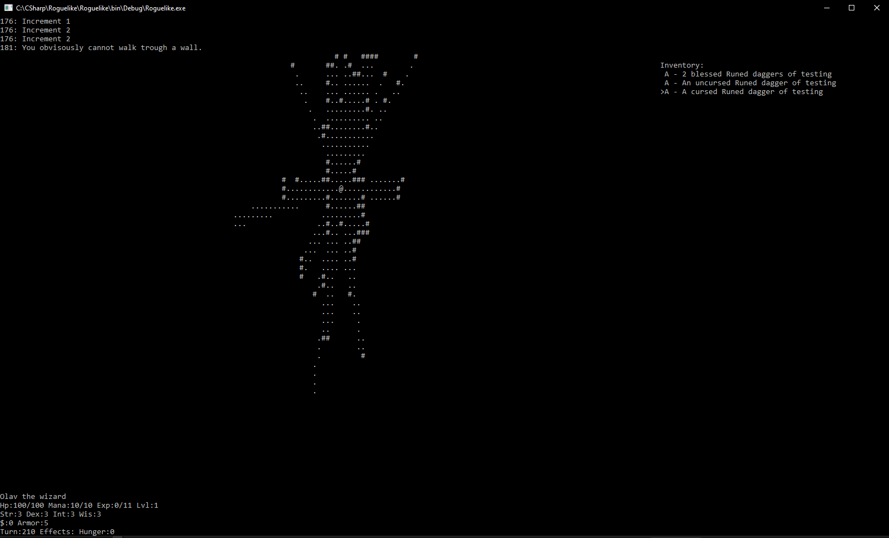

# Roguelike

## Overview

**Roguelike** is a procedurally generated, ASCII-based game that is currently under development. The game is inspired by classic roguelikes, featuring a simple yet effective line-of-sight system and basic inventory management. The project showcases my ability to work with procedural generation, user interface design in a command-line environment, and basic game mechanics.

## Features

- **Procedurally Generated Levels:** Each playthrough generates a new dungeon layout, ensuring a unique experience every time.
- **ASCII Graphics:** The game uses ASCII characters to represent the dungeon, similar to the classic Rogue game.
- **Line of Sight:** The player can only see areas of the dungeon within their line of sight.
- **Basic Movement:** Navigate the dungeon using the `W`, `A`, `S`, `D` keys.
- **Inventory System:** 
  - Press `I` to access the inventory.
  - Use `W` and `S` to navigate through the inventory.
- **User Interface:**
  - **Stats Display:** The bottom left corner of the screen displays the player's current stats.
  - **Game Messages:** The top left corner of the screen displays messages about in-game events, providing feedback on actions and encounters.

## Current State

This project is a work in progress, with core movement and interface mechanics in place. Future developments will include combat, item interactions, and more complex dungeon features. The current version serves as a foundation for demonstrating key gameplay elements and coding practices.

## Getting Started

### Prerequisites

- Ensure you have a C# development environment set up. This project was built using .NET.

### Installation

1. Clone the repository to your local machine:
   ```bash
   git clone https://github.com/Olavman/Roguelike.git
   
2. Navigate to the project directory:
   ```bash
   cd Roguelike

3. Open the project in your preferred C# IDE (e.g. Visual studio).

4. Build and run the project from the IDE.

## Controls
- **Movement:** 'W', 'A', 'S', 'D' keys to move through the dungeon.
- **Inventory:** 'I' to enter the inventory, 'W' and 'S' to navigate.
- **Game interface:**
  - Player stats are shown in the bottom left.
  - Game messages are displayed in the top left.
 
## Gameplay screenshot

